# Jenian Client

[](https://nextjs.org/)
[](https://react.dev/)
[](https://www.typescriptlang.org/)
[](https://tailwindcss.com/)
[](https://ui.shadcn.com/)
[](https://vercel.com/)

Next.js frontend for **Jenian**, a practical workplace productivity application that supports shift management, estimated pay calculations, and structured end-of-day report workflows for retail/pharmacy staff.

- **Live application:** <https://jenian-client.vercel.app>
- **Backend repository:** [Brian3010/JenianAPI](https://github.com/Brian3010/JenianAPI)
- **Demo access:** Select **Try demo account** on the sign-in page; no registration is required.

## Table of Contents

- [Overview](#overview)
- [Screenshots](#screenshots)
- [Main Features](#main-features)
- [Tech Stack](#tech-stack)
- [Architecture](#architecture)
- [Request Flow](#request-flow)
- [Authentication and Session Management](#authentication-and-session-management)
- [Demo Account Experience](#demo-account-experience)
- [Shift Calculator Design](#shift-calculator-design)
- [End-of-Day Report Design](#end-of-day-report-design)
- [Forms and Validation](#forms-and-validation)
- [Loading, Errors, and Cold Starts](#loading-errors-and-cold-starts)
- [Responsive Design and Accessibility](#responsive-design-and-accessibility)
- [Main Application Routes](#main-application-routes)
- [Local Development](#local-development)
- [Environment Variables](#environment-variables)
- [Quality Checks and Testing](#quality-checks-and-testing)
- [Deployment](#deployment)
- [Security Considerations](#security-considerations)
- [Related Repository](#related-repository)
- [Project Status](#project-status)
- [Author](#author)

## Overview

Jenian helps shift workers manage their pay cycles, record shifts, review estimated gross pay, and submit structured end-of-day operational reports covering deliveries, stock updates, night tasks, aisle facing, cleaning, and general checks.

**Motivation:** Jenian was created to reduce repetitive workplace administration I experienced firsthand. It also serves as a practical portfolio project demonstrating my ability to design, build, integrate, and deploy a real full-stack application.

This repository is responsible for:

- Rendering the public landing, authentication, dashboard, shift calculator, night report, and settings experiences
- Providing a responsive desktop and mobile interface
- Managing authenticated frontend sessions and protected routes
- Acting as a Backend-for-Frontend (BFF) between browser code and the ASP.NET Core API
- Managing interactive shift editing before changes are saved
- Validating and submitting multi-step forms and file uploads
- Handling backend cold starts, loading states, request errors, and route-level failures

The frontend was designed and developed independently, including its architecture, authenticated BFF integration, shift-management experience, report workflow, responsive UI, and Vercel deployment.

## Screenshots

### Homepage

<p align="center">
  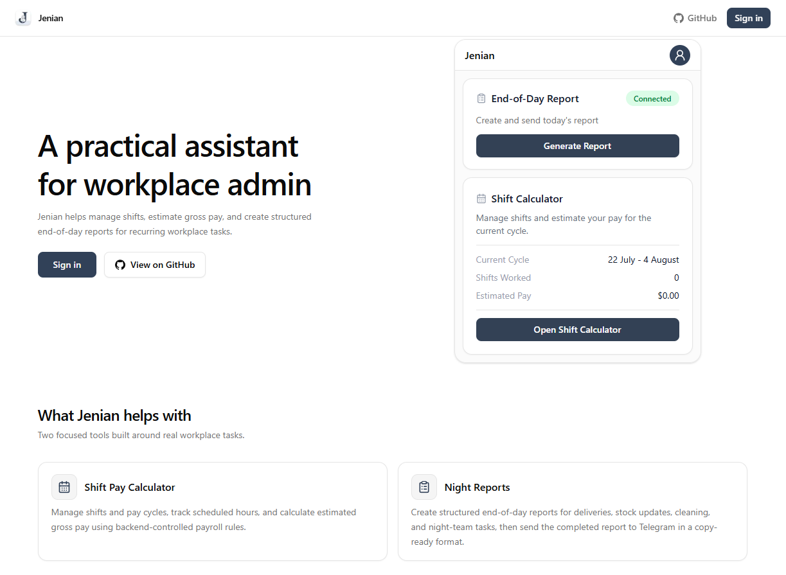
</p>

### Dashboard

<table align="center">
  <tr>
    <th align="center">Before setup</th>
    <th align="center">Connected and configured</th>
  </tr>
  <tr>
    <td align="center" valign="top">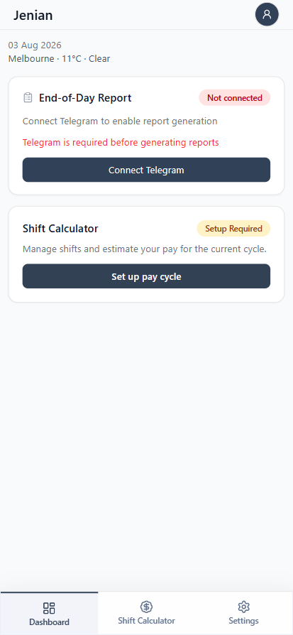</td>
    <td align="center" valign="top">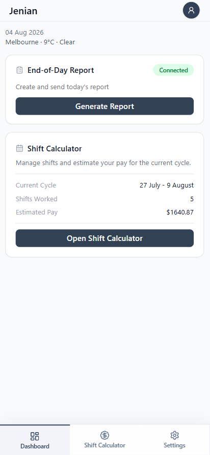</td>
  </tr>
</table>

### Shift Calculator

<table align="center">
  <tr>
    <th align="center">Pay-cycle setup</th>
    <th align="center">Calculator overview</th>
  </tr>
  <tr>
    <td align="center" valign="top">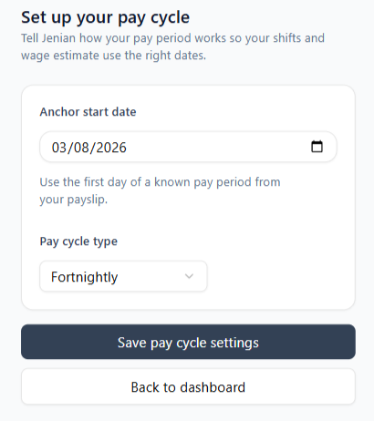</td>
    <td align="center" valign="top">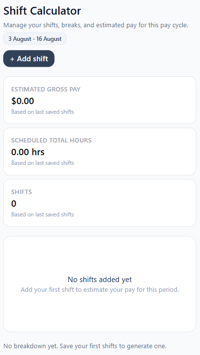</td>
  </tr>
  <tr>
    <th align="center">Edit a shift</th>
    <th align="center">Calculated pay breakdown</th>
  </tr>
  <tr>
    <td align="center" valign="top">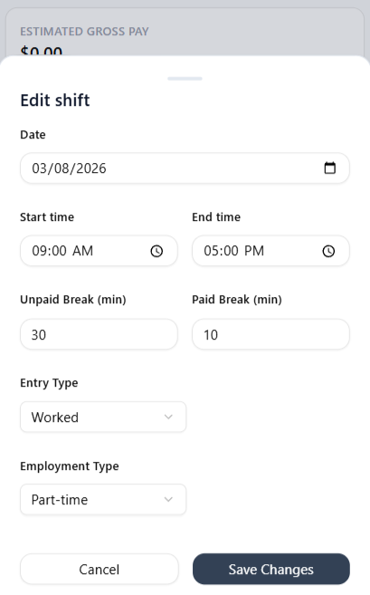</td>
    <td align="center" valign="top">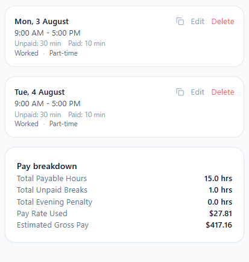</td>
  </tr>
</table>

<details>
  <summary>View additional Shift Calculator screens</summary>

  <table align="center">
    <tr>
      <th align="center">Duplicate a shift</th>
      <th align="center">Review unsaved shifts</th>
    </tr>
    <tr>
      <td align="center" valign="top">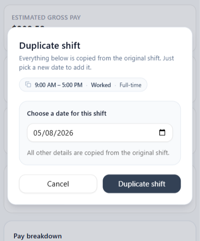</td>
      <td align="center" valign="top">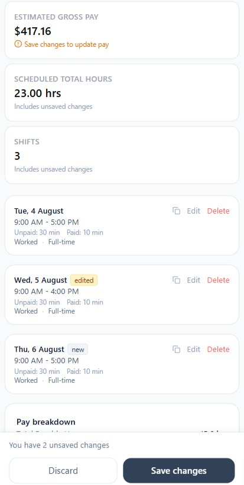</td>
    </tr>
  </table>
</details>

### End-of-Day Report

<table align="center">
  <tr>
    <th align="center">Connect Telegram</th>
    <th align="center">Upload delivery details</th>
  </tr>
  <tr>
    <td align="center" valign="top">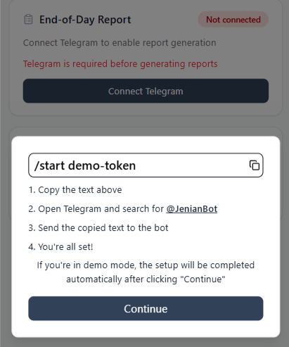</td>
    <td align="center" valign="top">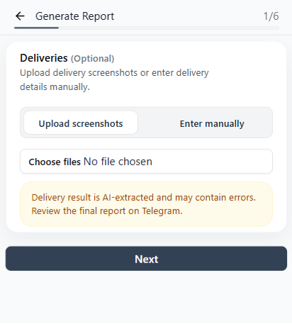</td>
  </tr>
  <tr>
    <th align="center" colspan="2">Complete a later report step</th>
  </tr>
  <tr>
    <td align="center" valign="top" colspan="2">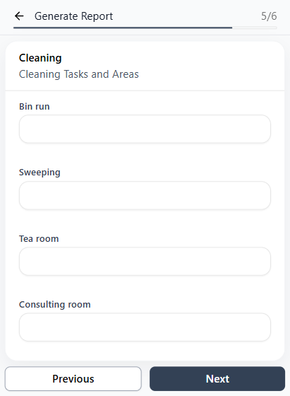</td>
  </tr>
</table>

## Main Features

- Username/password authentication with invite-gated registration
- One-click demo account for portfolio reviewers
- Protected dashboard, shift calculator, night report, and settings routes
- Pay-cycle setup for first-time users
- Shift creation, editing, deletion, duplication, and bulk saving
- Backend-calculated daily pay summaries and estimated gross pay
- Multi-step end-of-day report with section-level validation
- Report drafts saved to `localStorage` and restored after reload
- Delivery screenshot uploads with client-side validation, resizing, and compression
- Telegram account linking through generated link tokens
- Backend cold-start detection with progress, retry, and failure states
- Responsive desktop sidebar and mobile bottom navigation
- Shared loading, notification, and error-boundary components

## Tech Stack

- **Next.js 16** using the App Router
- **React 19** and **TypeScript 5**
- **Tailwind CSS 4**
- **shadcn/ui** conventions on top of **Radix UI** primitives
- **React Hook Form** with **Zod** validation
- **jose** for server-side JWT verification
- **Luxon** for date and time handling
- **Lucide React** for icons
- **ESLint** with the Next.js configuration
- **Vercel** for frontend hosting and deployment

## Architecture

The frontend uses the Next.js App Router and follows a feature-based structure. Route pages are Server Components by default, while interactive forms and editing experiences are implemented as Client Components.

```text
app/         Routes, layouts, Server Components, Route Handlers, loading, and error UI
features/    Feature-specific components, schemas, services, reducers, and contexts
components/  Shared UI, layout, provider, notification, and error components
lib/         Authentication, API response handling, server fetch helpers, and utilities
hooks/       Reusable client-side hooks
proxy.ts     Public/private route rules and session-cookie checks
```

Key architectural decisions:

- **Server Components** perform session checks and load initial page data.
- **Client Components** manage interactive forms, modal state, reducers, and pending UI.
- **Route Handlers** provide the BFF boundary for browser-originated API calls.
- **Feature folders** keep related UI, schemas, and services together.
- **Shared response parsers** normalise backend results into predictable frontend success/error shapes.

## Request Flow

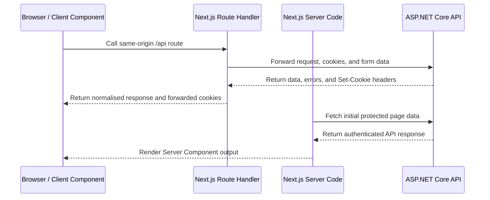

Browser code does not call the ASP.NET Core host directly. The BFF layer centralises cookie forwarding, authentication refresh, backend error handling, and response normalisation while keeping the backend base URL and server-only configuration out of client bundles.

## Authentication and Session Management

The ASP.NET Core backend owns credential validation and issues the authentication cookies. The frontend manages how those sessions are used across Next.js pages and Route Handlers.

- Login and registration forms post to same-origin Next.js Route Handlers.
- The Route Handlers forward requests to the ASP.NET Core authentication endpoints and relay backend `Set-Cookie` headers to the browser.
- Protected Server Components call `requireSession()` before loading private content.
- The access-token JWT is verified server-side using `jose` and the configured issuer, audience, and signing secret.
- `proxy.ts` checks for the required session cookies before allowing access to protected pages and private Route Handlers.
- Expired sessions are sent through the frontend refresh flow and returned to the originally requested page when refresh succeeds.
- Logout calls the backend logout endpoint and clears local authentication cookies.
- Server-side backend requests can refresh an expired access token and retry once when appropriate.

Final authentication and authorisation decisions remain the responsibility of the ASP.NET Core API. This section describes the frontend integration and is not a claim of complete or certified security.

## Demo Account Experience

The sign-in page provides a **Try demo account** option for reviewers who want to explore the application without creating an account.

The frontend calls its demo-account setup Route Handler, forwards the request to the backend, applies the returned authentication cookies, and redirects the visitor to the dashboard. The backend creates an isolated, temporary demo user so each demo session receives its own data scope.

Telegram report delivery is disabled for demo sessions because it requires a real linked Telegram account.

## Shift Calculator Design

The shift calculator separates local editing state from trusted backend calculations.

1. A Server Component loads the user's current pay-cycle metadata.
2. First-time users are shown a pay-cycle setup form.
3. Existing shifts and daily summaries are loaded for the selected cycle.
4. A client-side reducer tracks saved shifts, draft changes, and deleted shift IDs.
5. Add, edit, delete, and duplicate actions update local state without immediately changing the database.
6. Save submits all current shifts and deleted IDs in one bulk request.
7. The backend validates ownership, persists the changes, recalculates affected daily summaries, and returns the trusted result.
8. The frontend replaces its draft state with the saved response and updates the displayed estimated gross pay.

Payroll rules are deliberately not duplicated in browser code. The frontend collects and displays shift data; the ASP.NET Core backend remains the source of truth for pay calculations.

## End-of-Day Report Design

The night report is a multi-step React Hook Form workflow covering deliveries, stock updates, night tasks, aisle facing, cleaning, and a general check.

- Zod schemas validate each section before the user proceeds.
- Draft form values are saved to `localStorage` and restored after a reload.
- Delivery information can be entered manually or supported by uploaded screenshots.
- Files are checked for supported type and size before submission.
- Images are resized and compressed client-side to reduce upload size.
- The completed report is flattened into `FormData` and posted to a same-origin Route Handler.
- The Route Handler forwards the multipart request to the ASP.NET Core API and returns a normalised result to the UI.

For a linked non-demo account, the backend can deliver the completed report through the associated Telegram bot workflow.

## Forms and Validation

Forms use **React Hook Form** for form state and **Zod** for declarative validation.

Implemented patterns include:

- Shared schemas stored alongside their feature
- `FormProvider` and `useFormContext` for forms split across child components
- Inline field messages from `formState.errors`
- Form-level API errors and notification toasts
- Disabled buttons and progress indicators during submission
- Manual validation triggers for multi-step workflows
- `FormData` for file and multipart submissions

Client-side validation improves usability, but the ASP.NET Core API still performs the authoritative server-side validation.

## Loading, Errors, and Cold Starts

The frontend uses several layers of feedback rather than treating every failure as the same problem:

- App Router `loading.tsx` files provide route-segment loading states.
- Client forms show disabled actions and inline progress while requests are running.
- Route-level `error.tsx` and `global-error.tsx` files render a shared fallback component for unexpected rendering or data-loading failures.
- API response helpers separate expected HTTP/API errors from unexpected runtime failures.
- Network failures from BFF Route Handlers are converted into meaningful frontend responses.

The backend runs on cost-saving Azure infrastructure that can scale to zero. A dedicated backend wake gate calls the frontend health endpoint, displays clear startup messages, retries while the API starts, and presents a manual retry state when it remains unavailable. A short-lived readiness cookie prevents unnecessary repeat checks during the same session window.

## Responsive Design and Accessibility

- The authenticated desktop layout uses a collapsible sidebar.
- Mobile layouts use a bottom navigation bar for primary destinations.
- Pages and components follow a mobile-first Tailwind CSS approach.
- Shared controls are built with shadcn/ui conventions and Radix UI primitives.
- Dialogs, dropdowns, tooltips, and navigation elements use accessible Radix behaviour.
- Loading and error feedback uses appropriate status/alert semantics where implemented.

## Main Application Routes

| Route | Access | Purpose |
| --- | --- | --- |
| `/` | Public | Landing and portfolio overview |
| `/auth/sign-in` | Public | Sign in and access the demo account |
| `/auth/register` | Public | Invite-gated registration |
| `/demo-account` | Public | Starts a temporary demo session |
| `/refresh` | Public | Refreshes the session and returns to the requested page |
| `/dashboard` | Private | Telegram status and current shift/pay summary |
| `/chemist-warehouse/shift-calculator` | Private | Pay-cycle setup and shift management |
| `/chemist-warehouse/create-report` | Private | Multi-step end-of-day report |
| `/settings` | Private | Account actions, Telegram linking, and logout |

## Local Development

### Prerequisites

- Node.js and npm
- A running Jenian ASP.NET Core API
- The environment variables listed below

### Clone and Install

```bash
git clone https://github.com/Brian3010/jenian-client.git
cd jenian-client
npm install
```

### Configure the Environment

```bash
cp .env.example .env.local
```

If `.env.example` has not yet been added, create `.env.local` manually using the keys in [Environment Variables](#environment-variables).

### Run the Development Server

```bash
npm run dev
```

Open http://localhost:3000 in your browser.

### Production Build

```bash
npm run build
npm start
```

## Environment Variables

| Variable | Required | Purpose |
| --- | --- | --- |
| `BACKEND_URL` | Yes | Server-side base URL for the ASP.NET Core API |
| `JWT_SECRET` | Yes | Secret used by Next.js server code to verify access-token JWTs |
| `JWT_ISSUER` | Yes | Expected JWT issuer |
| `JWT_AUDIENCE` | Yes | Expected JWT audience |
| `NEXT_PUBLIC_APP_URL` | Yes | Public frontend URL used when constructing redirect targets |

`NEXT_PUBLIC_*` values are included in client-side JavaScript and are visible to application users. Never store JWT secrets, backend credentials, API keys, or other private configuration behind a `NEXT_PUBLIC_` prefix.

## Quality Checks and Testing

The repository currently provides the following automated checks:

```bash
npm run lint
npm run build
```

- `npm run lint` runs ESLint with the Next.js configuration.
- `npm run build` produces a production build and performs Next.js/TypeScript checks.
- There is currently no automated frontend unit, component, or end-to-end test suite.

The absence of a frontend test suite is documented as a current limitation rather than presented as full test coverage.

## Deployment

The frontend is deployed on Vercel:

**<https://jenian-client.vercel.app>**

The production application is built from the repository and hosted separately from the backend. The ASP.NET Core API is containerised and deployed to Azure, while this Next.js repository owns the browser-facing application and BFF layer.

Backend deployment, SQL configuration, Docker setup, and GitHub Actions documentation are maintained in the backend repository.

## Security Considerations

Implemented frontend protections and boundaries include:

- Browser requests use same-origin Next.js Route Handlers instead of directly exposing the backend host in client code.
- Authentication cookies are issued by the backend and forwarded through server-side Route Handlers.
- Protected pages perform server-side session checks before rendering private content.
- Access-token JWT verification is performed in server-only code.
- Server-only environment variables are not exposed through the `NEXT_PUBLIC_` namespace.
- Client validation is treated as a usability layer; the backend remains responsible for trusted validation and authorisation.
- Logout and failed refresh flows clear the frontend session and redirect to sign-in.

The security of the complete system also depends on the backend implementation, cookie configuration, hosting environment, and secret management documented in the Jenian API repository.

## Related Repository

The ASP.NET Core backend contains authentication, database access, pay-calculation rules, OCR and Telegram integrations, rate limiting, testing, Docker configuration, and Azure deployment.

[Brian3010/JenianAPI](https://github.com/Brian3010/JenianAPI)

## Project Status

**Completed / working today:**

- Public landing, authentication, refresh, logout, and demo-account flows
- Protected dashboard, shift calculator, night report, and settings areas
- Pay-cycle setup and reducer-based bulk shift editing
- Display of backend-calculated daily summaries and estimated gross pay
- Multi-step night report with draft restoration and image uploads
- Telegram account linking UI
- Backend wake-up, loading, retry, and route-level error handling
- Responsive desktop and mobile navigation
- Production deployment on Vercel

**Current limitations:**

- The first request after backend inactivity can take additional time while Azure starts a new container instance.
- Pay estimates are refreshed after saving; they are not recalculated live while shifts remain an unsaved draft.
- Demo sessions do not send reports through Telegram.
- Automated frontend unit and end-to-end tests have not yet been implemented.

## Author

Built by **Brian3010**.

- [GitHub](https://github.com/Brian3010)
- [LinkedIn](https://www.linkedin.com/in/brian-nguyen-411483196/)
